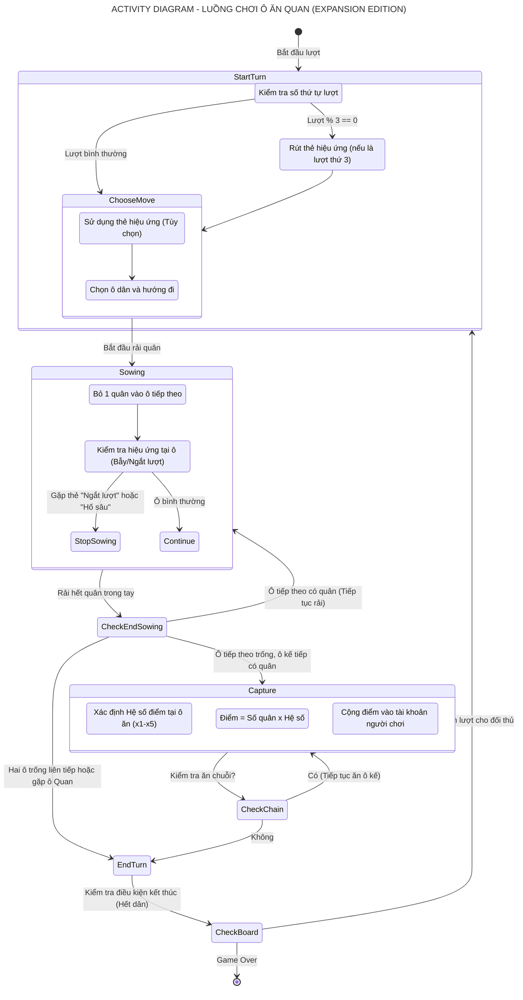

```mermaid
---
title: ACTIVITY DIAGRAM - LUỒNG CHƠI Ô ĂN QUAN (EXPANSION EDITION)
---
     
stateDiagram-v2
    [*] --> StartTurn: Bắt đầu lượt
    
    state StartTurn {
        CheckTurn: Kiểm tra số thứ tự lượt
        GetCard: Rút thẻ hiệu ứng (nếu là lượt thứ 3)
        CheckTurn --> GetCard: Lượt % 3 == 0
        CheckTurn --> ChooseMove: Lượt bình thường
        GetCard --> ChooseMove
    }

    state ChooseMove {
        Action: Chọn ô dân và hướng đi
        Effect: Sử dụng thẻ hiệu ứng (Tùy chọn)
        Effect --> Action
    }

    ChooseMove --> Sowing: Bắt đầu rải quân

    state Sowing {
        NextHole: Bỏ 1 quân vào ô tiếp theo
        CheckEffect: Kiểm tra hiệu ứng tại ô (Bẫy/Ngắt lượt)
        
        NextHole --> CheckEffect
        CheckEffect --> StopSowing: Gặp thẻ "Ngắt lượt" hoặc "Hố sâu"
        CheckEffect --> Continue: Ô bình thường
    }

    Sowing --> CheckEndSowing: Rải hết quân trong tay

    state CheckEndSowing <<choice>>
    CheckEndSowing --> Sowing: Ô tiếp theo có quân (Tiếp tục rải)
    CheckEndSowing --> Capture: Ô tiếp theo trống, ô kế tiếp có quân
    CheckEndSowing --> EndTurn: Hai ô trống liên tiếp hoặc gặp ô Quan

    state Capture {
        GetMultiplier: Xác định Hệ số điểm tại ô ăn (x1-x5)
        Calculate: Điểm = Số quân x Hệ số
        UpdateScore: Cộng điểm vào tài khoản người chơi
    }

    Capture --> CheckChain: Kiểm tra ăn chuỗi?
    CheckChain --> Capture: Có (Tiếp tục ăn ô kế)
    CheckChain --> EndTurn: Không

    EndTurn --> CheckBoard: Kiểm tra điều kiện kết thúc (Hết dân)
    CheckBoard --> [*]: Game Over
    CheckBoard --> StartTurn: Chuyển lượt cho đối thủ
```
