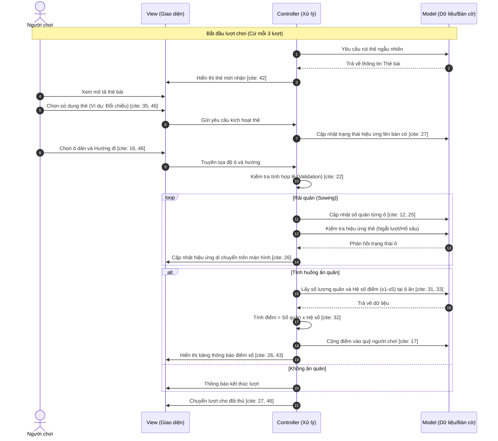

```mermaid
sequenceDiagram
    autonumber
    actor P as Người chơi
    participant V as View (Giao diện)
    participant C as Controller (Xử lý)
    participant M as Model (Dữ liệu/Bàn cờ)

    Note over P, M: Bắt đầu lượt chơi (Cứ mỗi 3 lượt)

    C->>M: Yêu cầu rút thẻ ngẫu nhiên 
    M-->>C: Trả về thông tin Thẻ bài
    C->>V: Hiển thị thẻ mới nhận [cite: 42]
    
    P->>V: Xem mô tả thẻ bài 
    P->>V: Chọn sử dụng thẻ (Ví dụ: Đổi chiều) [cite: 35, 46]
    V->>C: Gửi yêu cầu kích hoạt thẻ
    C->>M: Cập nhật trạng thái hiệu ứng lên bàn cờ [cite: 27]

    P->>V: Chọn ô dân và Hướng đi [cite: 16, 46]
    V->>C: Truyền tọa độ ô và hướng
    C->>C: Kiểm tra tính hợp lệ (Validation) [cite: 22]

    loop Rải quân (Sowing)
        C->>M: Cập nhật số quân từng ô [cite: 12, 25]
        C->>M: Kiểm tra hiệu ứng thẻ (Ngắt lượt/Hố sâu) 
        M-->>C: Phản hồi trạng thái ô
        C->>V: Cập nhật hiệu ứng di chuyển trên màn hình [cite: 26]
    end

    alt Tình huống ăn quân
        C->>M: Lấy số lượng quân và Hệ số điểm (x1-x5) tại ô ăn [cite: 31, 33]
        M-->>C: Trả về dữ liệu
        C->>C: Tính điểm = Số quân x Hệ số [cite: 32]
        C->>M: Cộng điểm vào quỹ người chơi [cite: 17]
        C->>V: Hiển thị bảng thông báo điểm số [cite: 26, 43]
    else Không ăn quân
        C->>V: Thông báo kết thúc lượt
    end

    C->>V: Chuyển lượt cho đối thủ [cite: 27, 46]
```
