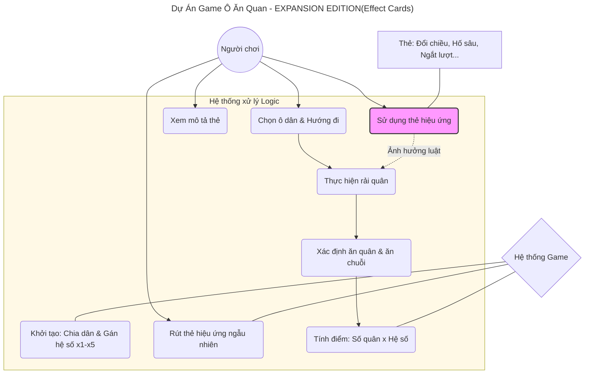

```mermaid
---
title: Dự Án Game Ô Ăn Quan - EXPANSION EDITION(Effect Cards)
---
graph TD
    %% Tác nhân
    Player((Người chơi))
    System{Hệ thống Game}

    %% Định nghĩa khung hệ thống với màu nền và nét liền
    subgraph Logic_Game [Hệ thống xử lý Logic]
        direction TB
        UC1(Khởi tạo: Chia dân & Gán hệ số x1-x5)
        UC2(Chọn ô dân & Hướng đi)
        UC3(Thực hiện rải quân)
        UC4(Rút thẻ hiệu ứng ngẫu nhiên)
        UC5(Xem mô tả thẻ)
        UC6(Sử dụng thẻ hiệu ứng)
        UC7(Tính điểm: Số quân x Hệ số)
        UC8(Xác định ăn quân & ăn chuỗi)
    end

    %% Luồng hành động của người chơi
    Player --> UC2
    Player --> UC4
    Player --> UC5
    Player --> UC6

    %% Hệ thống xử lý
    UC2 --> UC3
    UC3 --> UC8
    UC8 --> UC7
    UC6 -.->|Ảnh hưởng luật| UC3
    
    System --- UC1
    System --- UC4
    System --- UC7

    %% Chú thích và Style làm rõ khung
    style UC6 fill:#f9f,stroke:#333,stroke-width:2px
    
    %% Style cho khung System: Nền vàng nhạt, viền đậm nét liền
    style Logic_Game fill:#fff9e6
    
    note6[Thẻ: Đổi chiều, Hố sâu, Ngắt lượt...] --- UC6
```
